# 前端建筑绘 — 建筑实时绘制（水墨 · 朝向 · 贴格）

> 状态：**已落地**（平台无关实时绘制核心 + 生产前端接入 + 对拍 23/23 + 实机 A/B 差分确认）
> 日期：2026-09-13
> 建筑真源：`Server/Zongmen/Engine/js/mapgen.js` 的 `BUILDINGS`（地皮池）+ `CORE_KIND`（核心池）
> **绘制真源：`web/js/bldg_ink.js`**（唯一一份；原 `Engine/js/bldg_ink.js` 已删除）
> 出图工具：`tools/bldg_sheet.mjs`（26 种逐个看）· `tools/bldg_town.mjs`（引擎真实聚落平面）

> ⚠ **本文档 §三 / §四 的 26 张静态图**（`docs/建筑贴图/*.svg|png`，由 `tools/ink_buildings.mjs` 生成）
> 现在**只是造型设计稿与风格参考**，不再参与运行时渲染。
> 运行时的建筑是**每帧在浏览器 Canvas2D 现画**的，且**朝向由地形推导** —— 同一张"码头"在朝东的
> 水岸与朝北的水岸画出来是两个样子，26 张固定图表达不了这个维度。§五 起是实际落地的方案。

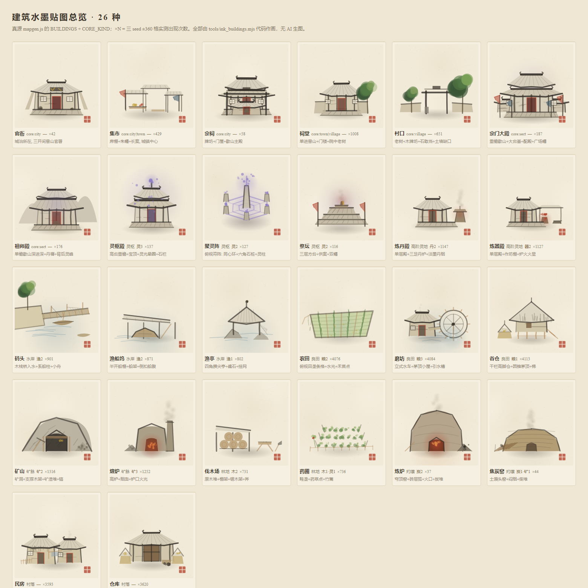

---

## 一、先回答：服务器到底有哪些建筑、哪些"不存在"

跑一遍 `verify/stats_buildings.mjs`（3 个 seed，各扫 ±360 格 = ±20 区域格）：

| 口径 | 结果 |
|------|------|
| `mapgen.js` 定义的建筑全集 | **26 种**（`BUILDINGS` 19 种 + `CORE_KIND` 去重 7 种） |
| 真实世界**从未出现**的建筑 | **0 种** —— 26 种全都跑得出来 |
| 聚落 / 建筑实例样本 | 2551 座聚落 · 31381 座建筑 |
| 足迹规划失败 | 0 |

**所以"服务器不存在的建筑"答案分两层：**

1. **生成层：一种都不缺。** 26 种全部会出现，没有"定义了但永不生成"的死代码。
2. **视觉层：改造前 26 种全都没有形象。** 这才是真问题 —— 以下为**改造前（2026-09-13 上午）**的状态，记录备查：
   - `web/js/textures.js` 的水墨图集 `ATLAS_ROWS=8`，第 5/6/7 行是山/雪/林/沙/草丛/灵脉峰/草丘/孤树，**没有任何一格是建筑**；
   - `灵脉预览.html` 里建筑只是 `LANDUSE_COL` 的**彩色六边形 + 方块芯**（`drawTownPlan`），按地皮上色，26 种建筑长得一模一样，只有地皮色块之分 —— ⚠ **这一条至今未改，见 §八 待办**；
   - 生产前端 `web/js/main.js` 连色块都没有，建筑只在宗门面板里显示为**文字 chip**（`kindsOf()` → `tagList()`，一行「农田3 民房2」）—— **已解决**，现已在六边格上按朝向实时绘制（§五）；
   - 唯一有形象的是 `renderer.js` 的 sprite 体系（索引 0~63），且 40~63 已被地形精灵占满 —— **已绕过**：建筑不走图集，走运行时绘制。

3. **另有一批"视觉上等同不存在"的稀有建筑。** 因为地皮门槛苛刻，出现次数极低，玩家在视野内几乎看不到：

| 建筑 | 出现次数 | 地皮 | 为什么少见 |
|------|---------:|------|-----------|
| 炼炉 | 37 | 灼壤 | 灼壤占比仅 2000/162243 ≈ 1.2%，且窑位要抢建筑上限 |
| 官衙 | 42 | core:city | 只在 city 中心格，city 仅 143 座 |
| 焦炭窑 | 44 | 灼壤 | 同炼炉 |
| 宗祠 | 58 | core:city | 同官衙（city 中心 3 选 1） |
| 祭坛 | 116 | 灵枢 | 灵枢地皮仅 203 个抽样格 |
| 聚灵阵 | 127 | 灵枢 | 同上 |
| 灵枢殿 | 137 | 灵枢 | 同上 |

> ⚠ 结论：**稀有 ≠ 可以不画**。恰恰相反，这 7 种是"玩家跑遍地图也见不到一次"的建筑，一旦画出来反而是荒野里的记忆点。它们已全部进绘制核心（26/26 有 painter），但**保底可见策略仍未落地**（见 §8.1 待办）。

---

## 二、建筑全集（26 种）与实测频次

> 频次 = 3 seed × ±360 格实测；`core:*` = 该规模的中心格专属建筑；「产出」列 = `BUILDINGS` 里的 `r/a`（主产出/量）与 `x/xa`（附加产出/量）。

### A. 核心建筑（7 种，落中心格，`terrain='core'`，无产出）

| # | 建筑 | 来源 | 次数 | 产出 | 一句话造型 | 贴图 |
|---|------|------|-----:|------|-----------|------|
| 1 | 官衙 | core:city | 42 | — | 三开间悬山官署 + 朱漆门 + 石狮 | 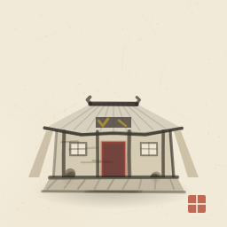 |
| 2 | 集市 | core:city/town | 429 | — | 三座高低席棚 + 朱幡 + 长案货担 | 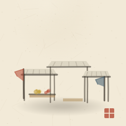 |
| 3 | 宗祠 | core:city | 58 | — | 牌坊 + 门屋 + 歇山主殿 + 香炉 | 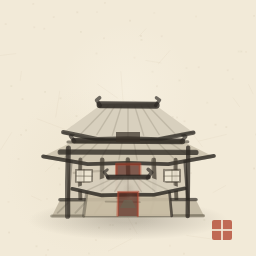 |
| 4 | 祠堂 | core:town/village | 1008 | — | 单进悬山 + 门楼 + 院中老树 | 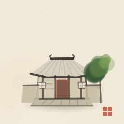 |
| 5 | 村口 | core:village | 651 | — | 老树 + 木牌坊 + 石敢当 + 土墙缺口 | 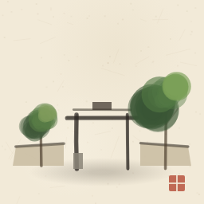 |
| 6 | 宗门大殿 | core:sect | 187 | — | 重檐歇山 + 大台基 + 双配殿 + 广场幡 | 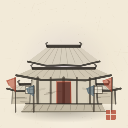 |
| 7 | 祖师殿 | core:sect | 176 | — | 单檐歇山深进深 + 丹墀香炉 + 背后灵峰 | 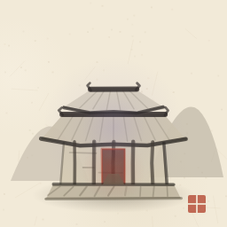 |

### B. 灵脉地皮（5 种）

| # | 建筑 | 地皮 | 次数 | 产出 | 一句话造型 | 贴图 |
|---|------|------|-----:|------|-----------|------|
| 8 | 灵枢殿 | 灵枢 | 137 | 灵3 | 高台重檐 + 宝顶 + 灵光晕圈 + 石栏 | 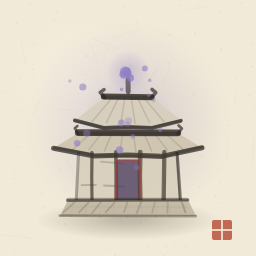 |
| 9 | 聚灵阵 | 灵枢 | 127 | 灵2 | **俯视**符阵：同心六边环 + 六角石桩 + 中心灵柱 | 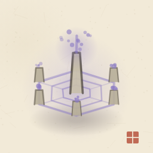 |
| 10 | 祭坛 | 灵枢 | 116 | 灵2 | 三层方台 + 供案 + 双幡 + 灵光 | 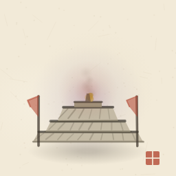 |
| 11 | 炼丹殿 | 高阶灵地 | 1147 | 丹2 | 单层殿 + 三足丹炉 + 淡墨丹烟 | 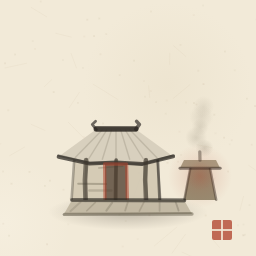 |
| 12 | 炼器殿 | 高阶灵地 | 1127 | 器2 | 单层殿 + 半开作坊棚 + 炉火火星 | 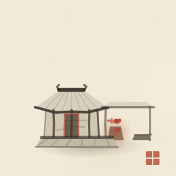 |

### C. 水岸地皮（3 种）

| # | 建筑 | 地皮 | 次数 | 产出 | 一句话造型 | 贴图 |
|---|------|------|-----:|------|-----------|------|
| 13 | 码头 | 水岸 | 901 | 渔2 | 岸树 + 木栈桥入水 + 系船柱 + 泊船 | 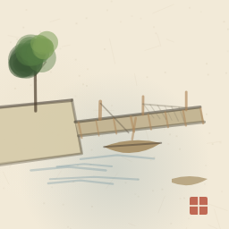 |
| 14 | 渔船坞 | 水岸 | 871 | 渔2 | 半开单坡船棚 + 船架 + 倒扣船腹 | 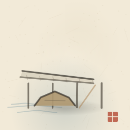 |
| 15 | 渔亭 | 水岸 | 802 | 渔1 | 四角攒尖亭立礁石 + 挂网 | 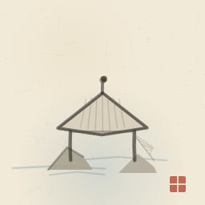 |

### D. 良田地皮（3 种，全地图最高频）

| # | 建筑 | 地皮 | 次数 | 产出 | 一句话造型 | 贴图 |
|---|------|------|-----:|------|-----------|------|
| 16 | 农田 | 良田 | 4076 | 粮2 | **俯视**透视田块 + 4 垄禾苗 + 水光 | 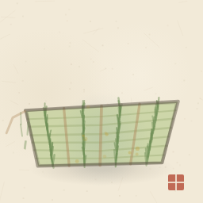 |
| 17 | 磨坊 | 良田 | 4084 | 粮3 | 轮辐式水车 + 茅顶小屋 + 引水槽 | 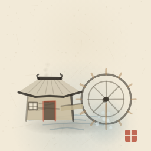 |
| 18 | 谷仓 | 良田 | 4113 | 粮1 | 干栏高脚仓 + 矮阔圆锥茅顶 + 梯 + 粮囤 | 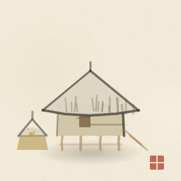 |

### E. 矿脉地皮（2 种）

| # | 建筑 | 地皮 | 次数 | 产出 | 一句话造型 | 贴图 |
|---|------|------|-----:|------|-----------|------|
| 19 | 矿山 | 矿脉 | 1316 | 矿2 | 山体断面 + 矿洞 + 支撑木架 + 矿渣堆 + 镐 | 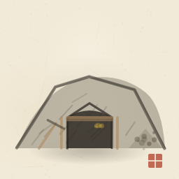 |
| 20 | 熔炉 | 矿脉 | 1252 | 矿3 | 高炉 + 独立烟囱 + 炉口火光 + 炉渣 | 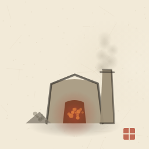 |

### F. 林 / 灼壤地皮（4 种）

| # | 建筑 | 地皮 | 次数 | 产出 | 一句话造型 | 贴图 |
|---|------|------|-----:|------|-----------|------|
| 21 | 伐木场 | 林地 | 731 | 木2 | 棚架 + 三层原木堆 + 锯木架 + 斧 | 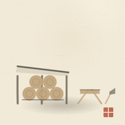 |
| 22 | 药圃 | 林地 | 736 | 木1·灵1 | 三列畦垄 + 药草椿点 + 竹篱 | 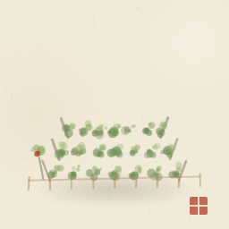 |
| 23 | 炼炉 | 灼壤 | 37 | 炭2 | 圆穹砖窑 + 三层砖弧 + 拱形炉口大火 | 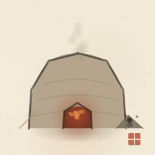 |
| 24 | 焦炭窑 | 灼壤 | 44 | 炭1·矿1 | 低矮土馒头窑 + 夯土横纹 + 闷烟 + 柴堆 | 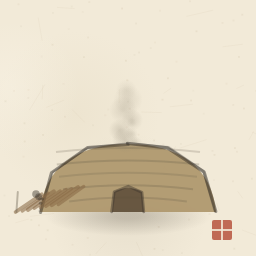 |

### G. 村落皮（2 种，城区内环保底）

| # | 建筑 | 地皮 | 次数 | 产出 | 一句话造型 | 贴图 |
|---|------|------|-----:|------|-----------|------|
| 25 | 民房 | 村落 | 3593 | — | 两间茅屋前后错落 + 竹篱 + 晒竿 | 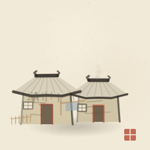 |
| 26 | 仓库 | 村落 | 3620 | — | 长条悬山房 + 大仓门 + 双粮囤 + 板车 | 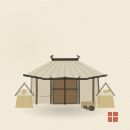 |

### 附：不属于建筑、但同图层要画的"景点"

`mapgen.js` 的 `NAME.poi` 共 10 种秘境界面（`type='poi'`，无建筑足迹，只有 1 个实体点）：
星坠秘境 / 古修洞府 / 灵泉福地 / 上古遗迹 / 锁妖塔残址 / 仙人遗冢 / 藏经洞 / 剑冢 / 丹炉遗谷 / 缚灵渊。

聚落类型 4 种（city / town / village / sect）已有 `SETTLE_STYLE` 形状标记，不在本轮范围。
地皮配色真源 `LANDUSE_COL`：core `#ffe9a8` · 灵枢 `#c79bff` · 高阶灵地 `#a98bd8` · 水岸 `#7fc9e8` · 良田 `#cfdc8f` · 矿脉 `#c2b49a` · 林地 `#8fbf8a` · 灼壤 `#d8a06a` · 村落 `#cfc9bc`。

---

## 三、水墨风贴图设计——参考与规范

### 3.1 网上找的画法参考（提炼要点）

| 来源 | 有用的结论 |
|------|-----------|
| [中国山水画点景建筑 · 亭台茅舍](https://www.sohu.com/a/950615941_121124795) | **墨分五色（焦/浓/重/淡/清）**；繁处藏简、简处藏意；近景墨可重细节可多但仍需简，中景以淡墨为主、只用少量重墨点关键部位（亭顶脊、门窗框）。**按材料选笔墨**：木/石亭柱用「中锋渴笔」带顿挫写木纹；亭顶飞檐用「侧锋淡墨」扫出弧度显轻盈；石台基用「披麻皴」轻擦，且**台基皴法要与周围山石一致**；夯土茅舍不用勾轮廓，淡赭石加墨「没骨法」铺墙，再干笔蘸浓墨扫墙皮剥落；茅草顶用**散锋点染**。 |
| [山水画点景技法·屋宇（倪瓒《紫芝山房图》）](https://www.sohu.com/a/192860778_825188) | 亭的画序：**① 起笔宝顶**（中墨偏重落墨，先定顶形再顺势勾亭角，亭角上翘须左右对称）→ **② 刻画瓦片**（较重墨，排列整齐、基本平行略带弧度）→ **③ 描绘飞檐**（线条纤细轻盈、向上翘起；双层瓦面要体现上下层平行关系）→ **④ 添景增色**（栏杆/石/树映衬）。瓦房的瓦要**长短不一而乱中有序**。 |
| [山水技法：一学就会画点景房屋](https://m.toutiao.com/article/7548274363548598794) | 茅草屋画序：**① 略带弯曲的墨线画屋顶轮廓 → ② 屋顶边缘密排短线（茅草）→ ③ 勾房屋四面线条增强立体感 → ④ 补窗户等细节**。瓦房：正面屋顶近似三角形 + 侧面用流畅轻盈的线 + 檐下梁柱**线条长短有别**来拉开空间。 |
| [程序化水墨（algorithmic_ink_studio）](http://github.me/TouHikari/algorithmic_ink_studio) | 笔刷掩膜 + **飞白参数**（高飞白区域随机产生低不透明度点，露出纸色）+ 湿润度**延迟局部晕染**（双边滤波）；墨色叠加取「暗」以模拟墨水下渗变深。 |
| [基于 Canvas 的数字水墨生成](https://wenku.csdn.net/column/uz8gnr4nipn) / [用代码绘丹青](https://tsight.io/articles/9014844) | 毛笔笔触 = Perlin/noise **抖动**而非直线；亮度 = 基础亮度 + noise×振幅；区域控制用「禁区」跳绘形成稀疏感；多层叠加 + 模糊柔化边缘。 |
| [SVG 禅意水墨笔触](https://xsctbench.com/testcase/w_svganima_028/glm-5.2) | 毛笔边缘的渗透感可用 **`feTurbulence` + `feDisplacementMap`** 让笔画边缘不规则起伏；宣纸底 `#f4ecd8` + 噪点 multiply；朱砂印章点缀。 |

### 3.2 落到本工程的笔法规范

本工程 `web/js/textures.js` 已有一整套水墨笔法引擎（`strokeInk` / `wash` / `dotCluster` / `drawPropPeak` / `propTree`），**建筑沿用同一套语言，不能另起一套画风**。落地时把这套语言迁进了绘制核心 `web/js/bldg_ink.js`（笔法基元签名与设计稿生成器 `tools/ink_buildings.mjs` 同源，便于两侧对读）。对应关系：

| 参考里的画法 | 实现（`bldg_ink.js` 的 `ink(S,pts,o)`，与 `tools/ink_buildings.mjs` 的 `stroke` 同签名） |
|-------------|--------------------------------------|
| 中锋渴笔（木柱、屋身） | `stroke(pts,{w,n:2,fly:false,j:0.4})` —— 叠 2 层 + 轻微抖动，关掉飞白保留"渴"感 |
| 侧锋淡墨（飞檐、瓦垄） | `stroke(...,{c:INK4,a:0.3,w:0.8})` —— 淡墨细线，只勾不压 |
| 散锋点染（茅草） | `stroke` 沿檐口密排 10~16 根短笔 + 随机抖动 `j:0.6` |
| 飞白（枯笔露纸） | `stroke` 内建第 3 层：纸色（`#f2ead8`）随机 `stroke-dasharray` 叠线，`stroke-opacity 0.42` |
| 没骨铺面（夯土墙） | `body()` → 赭石混墨 `#cbbfa2~#d6cba9` + 低透明，再用干笔扫 3~6 道墙皮剥落 |
| 披麻皴（石台基） | `platform()` → 沿台基面斜向短笔 7~11 道，`a:0.20~0.34` |
| 墨分五色 | `INK #2b2621`(焦) → `INK2 #3f382e`(浓) → `INK3 #5b5343`(重) → `INK4 #837a68`(淡) → `INK5 #aca393`(清) |
| 瓦垄整齐略带弧度 | `roof()` → 从脊到檐等分 `tiles` 条线，末端按 `|t-0.5|` 抬升形成反宇 |
| 反宇起翘 | `roof()` 檐口用 `Q` 曲线：两端抬 `tip`，中间下沉 —— 这就是"起翘" |
| 朱砂点睛 | 门框 / 幡 / 印（`CINNABAR #b2452f`），**全图只用在 1~2 处**，多了就俗 |
| 底 —— **无**（用户明确否决背景图案） | 运行时**不画宣纸/朱砂印/纹样**。唯一"底"是六边格淡色基座 `hexPlate()`（地皮色 `LANDUSE_TINT`，由 `plate` / `plateA` 参数控制，前端传 `plateA:0.16`，格面几乎只剩一层透气感）+ 一块压扁的落影。设计稿里的 `paperBase()` 已**不再使用**。 |

**三条硬约束（照抄 `textures.js` 的经验教训）：**

1. **不闭合的轮廓线要慎用**。`textures.js` 里"接地投影椭圆""山脚碎石点"都因为密排时连成黑线穿帮而被删掉。建筑同样：**落影只给水岸/平地上的矮建筑**（码头、渔亭、磨坊、农田），山上的（矿山、熔炉）不画，避免城镇密排时糊成一团。
2. **格底边留给邻居**。建筑以"格心"为锚点绘制，横向铺开时可以越格（`SPR_BOX` 上界约 2.4R），但**正下方不许压到下一行的格心**，否则深度序会失效。
3. **一图一义**。每座只有 1 个视觉焦点（屋顶轮廓 + 1 个标志物），不要在一格里塞多个主体。


---

## 四、26 种的造型设计稿（风格参考，非运行产物）

> 全部图为 **代码生成**（`tools/ink_buildings.mjs`），非 AI 生图。画布统一 `viewBox 0 0 128 128`，地平基线 y≈106，中线 x=64，缩放 2× 输出 256×256。
> 「代码要点」列的函数名与常量都在 `tools/ink_buildings.mjs` 里，改图直接改对应 painter。
>
> ⚠ **本节是"正面朝南"的静态稿**。运行时由 `web/js/bldg_ink.js` 按 §六 的朝向规则重新投影，造型元素（屋脊/瓦垄/栈桥/水车/洞口/幡…）取自本节，但**构图会随朝向改变**。

### 4.1 核心建筑

#### 1 官衙 `guan_ya`（city 中心）
- **造型**：三开间悬山顶官署，两侧八字墙外撇，门前两尊石狮，高台基 + 踏道。
- **笔墨**：屋身用较亮的赭白没骨（官署粉墙），门板压朱（`#5a2420` 深朱），屋顶是全图最重的一组线（`roof(tip=2.6, tiles=9)`），八字墙只用 2 笔侧锋勾出。
- **代码要点**：`body(64,74,100,34)` → `roof(64,58,12,74,36)` → `columns(...,[-28,-9,9,28],{w:2.2})` → `doorway(64,100,13,20)` → 匾额 `face + GAMBOGE 两笔` → 石狮用 `dots(...,5,INK3,2.4)` → `platform(64,100,36,8,{cun:9})`。

#### 2 集市 `ji_shi`（city/town 中心）
- **造型**：三座高低错落的席棚（顶棚是斜梯形，立柱只在两端 2 根），前方长条货案 + 货担，左右各一幡。
- **笔墨**：棚顶淡墨没骨 + 檐口一道重墨；棚下立柱用最细的 `w:1.3`；幡用朱砂与石青对比（**朱 1 面、青 1 面**，别两面都红）。
- **代码要点**：局部函数 `shed(cx,topY,hw,botY)` 复用三次 → `face` 画长案 + `dots(GAMBOGE)` 摆货 → `flag(24,100,30,CINNABAR)`。

#### 3 宗祠 `zong_ci`（city 中心）
- **造型**：三段纵深——门前**牌坊**（两根冲天柱 + 双横枋 + 匾）、**门屋**（矮一档的悬山）、**主殿**（腰檐 + 上层歇山顶），殿前香炉。
- **笔墨**：主殿腰檐用 `tip:3.4` 把反宇夸张一点显等级；牌坊柱用焦墨最重；香炉是一小块 `#6b6250` + `smoke(a:0.2)`。
- **代码要点**：先建主殿（`body`+双层 `roof`），再压门屋（`body(64,96,108,22)` + `roof(64,88,9,96,26,{tip:2.2})`），最后压牌坊（`columns(...,[-30,30],{c:INK,a:0.72})`）。

#### 4 祠堂 `ci_tang`（town/village 中心）
- **造型**：单进悬山 + 左右对称矮院墙（中间开口）+ 院右侧一株老树。
- **笔墨**：规格必须明显低于宗祠 —— 屋顶 `tiles:8` 但脊更短（`ridgeHW=10`），台基只有一层，树用三色冠 `dots`。
- **代码要点**：`body(64,78,102,26)` → `roof(64,60,10,78,30)` → 两侧院墙用 `face([...],'#c6bba2')` + 顶线 `stroke` → `tree(104,106,46)`。

#### 5 村口 `cun_kou`（village 中心）
- **造型**：一段有缺口的矮土墙（左右两截），缺口中立木牌坊，牌坊旁一块石敢当，墙后一株老槐、左前一株小树。
- **笔墨**：全图最"简"的一张 —— 没有屋顶瓦垄，只有 3 根柱子 + 2 道横枋 + 扁额，用最省笔的方式交代"这里进村了"。
- **代码要点**：两截 `face([...],'#c9bda2')` + `stroke` 顶线 → `columns(64,72,106,[-16,16])` → 两道横枋 → 石敢当 1 个小梯形 → 两株 `tree`（一大一小破对称）。

#### 6 宗门大殿 `zong_men_dadian`（sect 中心）
- **造型**：**重檐歇山**主殿（腰檐 `tip:3.4` + 上层顶 `tip:3.0`）+ 大台基 + 左右各一座配殿 + 广场四面幡（2 朱 2 青）。
- **笔墨**：等级最高的一张 —— 屋身最亮、台基最宽、`platform({cun:11})` 皴笔最多；背景加 `aura(64,66,46,SPIRIT,0.16)` 一层灵光把它从地形里"托"出来。
- **代码要点**：配殿先画（左右对称，只 3 笔）→ 主殿 `body(64,78,104,34)` + 双 `roof` → `columns` 5 根 → `doorway(64,104,14,22,{a:0.82})` → 4 面 `flag`。

#### 7 祖师殿 `zu_shi_dian`（sect 中心）
- **造型**：单檐歇山但进深大（屋顶更"厚"），殿前丹墀香炉带灵光，**背景两座淡墨远峰**交代"祖师"气场。
- **笔墨**：远峰用 `INK5` 纯色 `pathD` 填充（`a:0.42~0.5`），不勾边不皴 —— 标准"中景淡墨"。这是 26 张里**唯一带背景层次**的一张。
- **代码要点**：先 `pathD` 两座远峰 → 再 `body`+双层 `roof` → 丹墀 `face` + `aura(CINNABAR,0.16)` + `smoke` → 全图再罩 `aura(64,72,40,SPIRIT,0.14)`。

### 4.2 灵脉地皮

#### 8 灵枢殿 `ling_shu_dian`
- **造型**：高台重檐殿 + 顶上升起**宝顶 + 灵光球**，台下正面一排石栏（9 根望柱）。
- **笔墨**：地皮本身的紫（`SPIRIT #8f7fc4`）**只能靠晕染出现，不能把建筑本身涂紫** —— `aura(64,62,52,SPIRIT,0.26)` 两层由外向内；宝顶用 `dots + wash` 做成一团发光的点。
- **代码要点**：`aura` 打底 → 建筑 → 石栏 `for i<9 stroke([[36+i*7,108],[·,103]])` → `dots(64,60,16,SPIRIT,1.4,40)` 撒星点。

#### 9 聚灵阵 `ju_ling_zhen`
- **造型**：**唯一俯视**的一张 —— 三层同心六边环 + 6 条辐条 + 6 根六角石桩 + 中心灵柱直插。
- **笔墨**：环用 `stroke(...,{fly:false})` 保证干净；辐条 `a:0.3` 极淡当"地纹"；石桩是唯一的实体，用双勾。
- **代码要点**：局部 `ring(r,a,w,c)` 生成六边形环（`y` 方向压扁 0.52 模拟俯视透视）→ 6 根桩 `face + stroke + dots` → 中心柱 `face([[59,78],[69,78],[67,44],[61,44]])` + 顶部 `wash(64,40,18,SPIRIT,0.36)`。
- ⚠ 这张是全套里唯一没有"墙"的，别改成正面视角 —— 聚灵阵在地面上，俯视才对。

#### 10 祭坛 `ji_tan`
- **造型**：三层递收方台（36→27→18 半宽）+ 顶层供案 + 香炉 + 左右双朱幡。
- **笔墨**：三层台基的 `platform({cun:10/8/6})` 皴笔数递减 —— 越往上越简，天然形成"上轻下重"。
- **代码要点**：三次 `platform` → 供案 `face` + `GAMBOGE` 供品点 → `smoke(64,68,20)` → 顶罩 `aura(64,66,22,CINNABAR,0.14)`。

#### 11 炼丹殿 `lian_dan_dian`
- **造型**：偏左的单层殿 + 右侧一尊三足丹炉（梯形炉身 + 炉盖 + 顶钮）+ 直上的淡墨烟柱。
- **笔墨**：丹烟是主视觉 —— `smoke(100,74,26,{a:0.26,n:5})` 用 5 团错位 `wash`，`a` 要压到 0.26 才像"烟"而不像"雾团"。
- **代码要点**：`body(58,80,100,22)` + `roof(58,64,9,80,26)` → 丹炉三块 `face`（炉身/炉盖/钮）→ 炉腹加 `aura(CINNABAR,0.2)`。
- ⚠ **炼丹殿与炼器殿必须一眼分开**：前者烟在"殿外的炉"，后者火星在"殿侧的作坊"。

#### 12 炼器殿 `lian_qi_dian`
- **造型**：偏左单层殿 + 右侧半开作坊棚（只有顶棚 + 2 柱）+ 棚下小炉 + 铁砧 + 一片飞溅火星。
- **笔墨**：火星用 `dots(84,88,12,CINNABAR,1.2,9,0.7)` —— 半径小、数量多、散布大、透明度高，才像"溅"。
- **代码要点**：`body(52,80,100,20)` + `roof` → 棚顶 `face` 单坡 + `columns(93,78,102,[-16,16],{w:1.4})` → 炉 `face` + `aura(CINNABAR,0.34)` → 铁砧小梯形。

### 4.3 水岸地皮

#### 13 码头 `ma_tou`
- **造型**：左上角岸（带一株树）→ 木栈桥向右上斜伸入水 → 3 根系船柱 + 缆绳 → 桥下泊船 + 右下远舟 + 柱间晒网。
- **笔墨**：水用 `water(88,{n:5})`（石青晕 + 5 道横波）；**栈桥必须画成"有厚度的板"**（上下两条边 + 8 根桥桩），单线会像栏杆。
- **代码要点**：先 `water` → 岸 `face` + `tree` → 桥面 `face([[42,68],[112,60],[114,68],[44,76]])` → 桥桩 `for i<8 stroke(向下 9px)` → 船 `pathD` 两处。
- ⚠ 构图是这张的命门：初稿把桥压在最底部，整个格子上半空 —— 已上移到 y≈60~90。

#### 14 渔船坞 `yu_chuan_wu`
- **造型**：半开单坡船棚（顶棚斜 + 4 柱）+ 棚下船架 + 架上倒扣的船腹（船底朝天的弧线）+ 斜靠的桨。
- **笔墨**：船腹是"倒扣"的，所以**轮廓要凸向上**（`[[34,104],[40,96],[54,90],[68,96],[74,104]]`），不能画成正浮的船。
- **代码要点**：棚顶 `face` + 2 道线 → 12 根瓦垄短线 → `columns(64,82,106,[-36,-12,12,36])` → 船腹 `face` + `stroke` 描边。

#### 15 渔亭 `yu_ting`
- **造型**：四角攒尖亭（三角形顶）+ 宝顶 + 4 柱（只画前后 2 根）立于礁石，右侧挂一张渔网。
- **笔墨**：按参考的"亭画序" —— 先宝顶（`stroke([[64,58],[64,52]])` + 3 点）→ 瓦垄（7 条按 `|i|` 收拢）→ 檐（顶三角形一条闭合折线）→ 最后添礁石与网。
- **代码要点**：`pathD('M 64 58 L 92 80 Q 78 84 64 84 Q 50 84 36 80 Z')` 一个 path 同时给攒尖顶 + 反宇檐 → 瓦垄 `for i=-3..3` → `columns(64,82,100,[-20,20])`。

### 4.4 良田地皮

#### 16 农田 `nong_tian`
- **造型**：一个透视四边形田块（左近右远），内部 **3 条纵向田埂分成 4 垄**，垄内 7 行 × 4 列的禾苗短竖笔，整体罩一层水光。
- **笔墨**：禾苗用 `JADE #6f8f57`，`a:0.42~0.64` 随机 —— **不画作物细节，只画"密度"**；田埂用赭石（`EARTH`）与禾苗形成色相差。
- **代码要点**：`lerp(a,b,t)` 做双线性插值，把田块的 4 垄 × 7 行映射到透视四边形；**田埂外圈最后压线**，否则会被禾苗盖住边界。
- ⚠ 初稿画成"直线网格铺满整格"，读起来像铁丝网 —— 加透视 + 收窄田块 + 补田边小路后才是农田。

#### 17 磨坊 `mo_fang`
- **造型**：左侧茅顶小屋 + 右侧立在水中/渠上的**轮辐式水车** + 二者之间的引水槽 + 轮下溅水。
- **笔墨**：水车按"轮"画 = 双圈轮辋（`ring(wr)` + `ring(wr*0.72)`）+ 8 根辐 + **外缘 12 个水斗**（短径向笔，伸出轮辋 4.2px）+ 轮毂点。只画辐条会变成星芒/蜘蛛。
- **代码要点**：`ring()` 用真 `<circle>`（不是多边形）→ `for i<8` 辐条 → `for i<12` 水斗 → `wash(wx,104,20,AZURE,0.26)` + `dots('#dfeaea')` 水花。

#### 18 谷仓 `gu_cang`
- **造型**：干栏高脚仓（4 腿 + 横撑）→ 仓身（带一扇小门）→ **矮阔圆锥茅顶**（出檐大，垂到仓身两侧）→ 右侧梯 → 左下一座圆锥粮囤。
- **笔墨**：茅顶要"低而阔"（顶点 y=50，檐口 y=78，檐半宽 34），太高会变成稻草人；16 根散锋短笔压在檐口下沿做茅草。
- **代码要点**：`columns(64,96,106,[-20,-7,7,20],{c:EARTH})` 高脚 → `body(64,74,96,24,{taper:0.05})` → 茅顶 `pathD` + 3 条 `stroke` → 粮囤 = 小块 `face` + `pathD('M13 96 Q23 84 33 96 Z')` + 顶钮。

### 4.5 矿 / 林 / 灼壤

#### 19 矿山 `kuang_shan`
- **造型**：一整面山体断面（半圆弧顶）→ 中央黑色拱形**矿洞** → 洞前木支撑门架（一横两竖）→ 右侧矿渣堆 + 左下镐 + 洞内矿苗亮点。
- **笔墨**：山体用 `#b8b0a0` 淡没骨 + **14 道披麻皴**（`a:0.20~0.36`）；洞口直接压焦墨 `a:0.82` —— 这是全图唯一的"黑洞"，视觉锚点。
- **代码要点**：`pathD` 断面 → `wash` 亮部 → 14 道皴 → 洞 `pathD(拱形,INK,0.82)` → 门架 4 笔 `stroke(EARTH)` → 渣堆 `face` + `dots(INK3)`。

#### 20 熔炉 `rong_lu`
- **造型**：梯形高炉（炉腹鼓出）+ 炉口拱形大火（橙）→ **右侧独立高烟囱** + 直上浓烟 → 左侧炉渣堆。
- **笔墨**：火是全图唯一的高饱和 —— `aura(64,98,20,CINNABAR,0.5)` + 14 点 `#e08040`；炉口用深赭 `#6b3a22` 做底，亮才亮得出来。
- **代码要点**：`pathD('M 40 106 L 44 72 Q 64 64 84 72 L 88 106 Z')` 炉腹 → 炉口 `pathD` → 烟囱 `face([[86,106],[98,106],[96,60],[88,60]])` + `stroke` 顶端封口 → `smoke(92,58,30,{a:0.3,n:6})`。

#### 21 伐木场 `fa_mu_chang`
- **造型**：左侧单坡棚（3 柱）+ 棚下**三层原木堆**（3-2 排列的圆截面）+ 右侧锯木架（跨着一根木）+ 斧。
- **笔墨**：原木用 `log(x,y,r)` = 外圆 + 内年轮圈；**截面圆必须带中心小圈**，否则只是 5 个圆点不成"木"。
- **代码要点**：`log` 局部函数 → 底层 3 根 + 上层 2 根错位 → 地面一道 `stroke` 压底 → 锯木架 2 腿 + 横木。

#### 22 药圃 `yao_pu`
- **造型**：3 列畦垄（透视，越远越窄）+ 每列 7 丛药草（`JADE` 椿点 + 亮绿高光点）+ 前景一道竹篱 + 左侧一株开花药草（朱点）。
- **笔墨**：药草用 `dots` 而不是笔画 —— **椿点才能表现"丛"**；三列畦垄的左右边线用短笔 `stroke`（不闭合），避免和竹篱连成黑框。
- **代码要点**：`for row<3` 画畦垄 + `for j<7` 撒 5 点 `JADE` + 3 点亮绿；`fence(16,106,112,104,{n:8,h:7})` 竹篱。

#### 23 炼炉 `lian_lu`
- **造型**：**圆穹砖窑**（弧顶，`C` 曲线收顶）+ 3 层砖弧 + 拱形炉口大火（橙红 + 光晕）→ 烟 → 右侧炭堆 + 左侧铁钳。
- **笔墨**：与焦炭窑的唯一硬区分 = **有明火**（`aura(CINNABAR,0.52)` + 14 点橙）且**有砖层弧**（3 道 `INK4` 弧线）；土色偏灰（`#b3a288`）。
- **代码要点**：`pathD('M 24 106 C 24 56 42 44 64 44 C 86 44 104 56 104 106 Z')` 圆穹 → 3 道砖弧（宽 `30*sqrt(1-t²)+8`）→ 火口拱 `pathD` + `aura` + `dots`。

#### 24 焦炭窑 `jiao_tan_yao`
- **造型**：**低矮土馒头**（弧顶但顶点低 12px、横向宽 88px）+ 5 道夯土横纹 + 窑顶闷烟 + 窑门（无火）+ 左下大面积柴堆。
- **笔墨**：与炼炉的硬区分 = **无明火、无砖弧**，只有 `INK4` 闷烟（`a:0.28,n:6`）；土色偏黄褐（`#b0996f`）显"生土"。
- **代码要点**：`pathD('M 20 106 C 22 84 38 72 64 72 C 90 72 106 84 108 106 Z')` → 5 道夯土纹（`sqrt(1-t²)` 收窄）→ `smoke` 两处（顶 + 门）→ 8 根柴 `stroke('#8a6a46')`。

### 4.6 村落地皮

#### 25 民房 `min_fang`
- **造型**：两间茅屋**前后错落**（右后稍小、左前稍大），各带门与窗，檐口下方一排茅草散锋，左侧竹篱，右侧晒竿挂衣。
- **笔墨**：这是全地图出现最多的建筑（3593 次），所以**必须最简、最"素"**：只要 2 个屋顶轮廓 + 2 个门 + 2 个窗，多一笔都会在城镇里变成噪点。
- **代码要点**：右后屋先画（`body(84,82,104,18)` + `roof(84,68,7,82,22)`）→ 左前屋压上（`body(40,80,106,22)` + `roof(40,64,8,80,26)`）→ 12 根檐口散锋 → `fence` + 晒竿 + 衣物 `face('#9aa9b0',0.6)`。

#### 26 仓库 `cang_ku`
- **造型**：长条悬山房（5 柱）+ 中央大仓门（双门板 + 横闩）+ 左右各一座圆锥粮囤 + 右下一辆板车。
- **笔墨**：与民房的区分 = **横向更长（半宽 34）、门更大（24×24）、带粮囤**；门板用 `#7a6042` 木色 + 深色横闩一条。
- **代码要点**：`body(64,76,102,34,{taper:0.04})` → `roof(64,58,11,76,38,{tiles:9})` → 门 `face` + 中线 + 横闩 + 外框四笔 → `for x of [24,104]` 粮囤（下块 + 锥顶 `pathD` + 顶钮）→ 板车 2 轮 `dots`。

---

## 五、落地方式：运行时实时绘制（非图集）

### 5.1 为什么不是图集

原计划（把 26 张 256px 贴图塞进一张 `build_atlas`）**已废弃**。三条原因：

1. **朝向是连续维度，不是 26 个离散槽位。** 码头能朝 6 个方向，磨坊还要分"临水/旱碾"两种形态，农田的长垄要垂直于"最开阔方向"。26 张固定图表达不了，做成图集就得扩到 26 × 6 × 变体数倍。
2. **`renderer.js` 的图集是构建期常量。** `ATLAS_ROWS(=8)` 有构建期断言，且着色器里同源写死；占地 40~63 已满，扩行要同时改 4 处（含 `w5_sprite_range.mjs` 区间断言），回归面大。
3. **建筑是"实体层"，不是地形层。** 与地形混一张图集后，以后加建筑种类必被行数卡死。

于是改为：**写一个平台无关的水墨绘制核心，每帧按当前缩放档现画到小位图上缓存**。架构上它与 `renderer.js` 的地形渲染完全解耦，地形那条路一行没动。

### 5.2 绘制核心 `web/js/bldg_ink.js`

唯一真源，1789 行，`global.BldgInk` 导出。同一份代码跑三个调用方（前端 / 出图工具 / 对拍脚本），后端只有两个：

| 后端 | 构造 | 输出 | 用在哪 |
|------|------|------|--------|
| `CanvasBk` | `BI.canvasBackend(ctx)` | 画到真 `CanvasRenderingContext2D` | 游戏前端 `main.js`（运行时） |
| `SvgBk` | `BI.svgBackend()` | 累积 SVG 字符串 | `tools/bldg_sheet.mjs` / `bldg_town.mjs`（出图） |

后端接口只有 5 个动词：`line / quad / poly / circle / text`。**朝向驱动投影**是全套的地基（`frameOf` 第 216 行起）：

```js
U  = R * 0.78                     // 局部 1 单位 = U 像素
fx, fy   = normalize(face)        // 正面轴（缺省 face=(0,1) 即坐北朝南）
rx, ry   =  fy, -fx               // 右轴 = 正面轴顺时针 90°（朝南时右手指东）
KY = 0.62                         // 地面纵深压扁系数（越大越"俯视"）

S.p(u, v, h) = [ cx + (u*rx + v*fx) * U ,  cy + (u*ry + v*fy) * U * KY - h*U ]
S.g(u, v)    = S.p(u, v, 0)       // 地面点
S.d(u, v)    = -u*fx + v*fy       // 视深（面片排序：越大越靠观察者）
S.setFace(f)                      // 换朝向：fx/fy 与右轴一起随动
```

所有 painter 只写局部坐标 `(u,v,h)` —— **朝向换一个向量，整座建筑自动转向**，不用各画 6 遍。

### 5.3 绘制原语（26 个 painter 共用）

`hexPlate`（六边格淡基座）· `boxWalls` / `wallRect` · `placeDoor` / `placeWin` ·
`roofGable`（悬山）/ `roofHip`（歇山）/ `roofPyr`（攒尖）/ `roofCone`（茅顶圆堆）·
`slab` / `stairs` / `posts` / `columns` · `flag`（幡）· `tree` · `smoke` · `aura` · `fence` ·
`waterFan`（水面扇形波纹）· `heap`（矿渣/炭堆）· `shedOf` · `houseCore` ·
`gpQuad` / `gpLine` / `gpWash` / `gpHexRing`（**俯视**类专用：农田、聚灵阵）。

笔法基元沿用 `textures.js` 语言：`ink(S,pts,{w,c,a,n,fly,j,dash})`，`fly` 打开就在笔画上叠一层纸色 `stroke-dasharray` 做飞白。

### 5.4 生产前端接入（`web/js/main.js`）

`web/index.html` 的加载顺序（**不可颠倒**）：`pb.js` → `mapclient.js` → `textures.js` → `renderer.js` → **`bldg_ink.js`** → `main.js`。

`main.js` 新增建筑层（约 596~712 行），全部挂在**静态层** `renderStaticInto()` 里，在 `drawEntityList()` **之前**调用 `drawBuildings(ctx, vw, vh, z)`：

| 环节 | 做法 |
|------|------|
| 尺寸档 | `R_BUCKETS = [8,11,15,20,27,36,48,64]`（设备像素），按 `geo.hexR*z*dpr` 量化分桶；**换桶即 `spriteClear()`** → 单档位内缓存条数有界 |
| 缓存键 | `kind\|dirIdx\|variant\|R档\|detail\|tier\|water`（`BI.spriteOf`，上限 512 条）+ `rec.ox/oy/w/h` 描边外扩框 |
| 细节档 | `detail = z>=1.35 ? 3 : z>=0.9 ? 2 : 1`（飞白/瓦垄/小构件按档增删） |
| 深度序 | 世界 `y` 小者（远）先画，同深按 `q` 定序 → 遮挡关系稳定不闪 |
| 最小尺寸 | 屏幕格半径 `geo.hexR*z < 5px` 时整层不画，交回聚落图标 |
| 图标让位 | 建筑画上后（`bldgShown`），`drawEntityList` 里非 `poi` 的实体图标不再画，名牌落点改为落到**建筑群外沿**（`ps2.y + 4.8*hexR*z + 4`） |
| 重铸 | `regenerate()` 里 `BI.spriteClear()` + `lastRBucket = -1`（世界重铸后缓存必须失效） |
| 调试开关 | URL 加 `?nobldg=1` 关闭建筑层 → 供 headless A/B 差分取证 |

### 5.5 踩过的坑（改这块之前必读）

1. **`DIRS` 必须用精确值。** 初版写成 `0.866` 近似 √3/2，对拍出现 `2.5e-5` 级偏差 → 统一改为 `Math.sqrt(3)/2`。
2. **区块归属不能用 `round(q/chunkS)`。** 引擎 `chunkOfTile` 是「区块格心四候选取六边距最近 + 固定平局序」，`chunkS=21` 时 `(32,32)` 归 `(2,1)` 而 `round` 给 `(2,2)`。前端 `biomeAt()` 改为**枚举 4 个候选区块 + 用索引成员判定**（索引由服务端 `qrel` 生成，归属天然权威，不必复制平局规则）。
3. **磨坊不能假定"必临水"。** 磨坊地皮是"良田"，多数格 3 环内无水面。`faceInfo()` 因此返回 `{face, water}`；`water=false` 时改画**旱碾**（碾盘 + 碾杆 + 谷袋），不画水车与引水槽。
4. **`water` 必须进缓存键**，否则同格先渲染出旱碾、后渲染出临水版会互相串味。
5. **`renderStaticInto()` 由 `staticDirty` 门控**。建筑是从 `settle` 载荷出来的，落区块时若不同时置脏，会一直画不出来。
6. **服务端在跑时不要重建。** `Zongmen.exe` 已运行时 `dotnet build` 会失败；但 `web/` 是**按 mtime 重读**的静态文件，改前端**不需要重启服务端**。
7. **投影千万不能闭包捕获 `fx/fy`。** `S.p` / `S.d` 必须从 `this.fx/fy` 读（因为 `paint()` 在 `frameOf` 之后才按规则推导出真朝向并调用 `S.setFace()`）。若闭包捕获了初值，朝向改不动投影 → **所有建筑塌成一条竖线**（2026-09-13 实测踩过，代码里留有这条注释）。

---

## 六、朝向规则 · 落格 · 变体

### 6.1 朝向规则表（8 条规则覆盖 26 种）

朝向**由地缘决定，不是随机** —— `FACE_RULE[kind]` → `resolveFace()` 配合探针 `probe` 求解：

| 规则 | 建筑 | 语义 |
|------|------|------|
| `water` | 码头、渔船坞、渔亭、磨坊 | 朝水面：栈桥 / 水车 / 船台伸向邻水方向 |
| `open` | 农田、药圃 | 朝最开阔方向：田垄垂直于该向（取"朝中枢"的反向） |
| `center` | 民房、仓库、集市 | 朝聚落中枢：街门面向核心格 |
| `away` | 村口 | 背对中枢，朝城外 |
| `south` | 官衙、宗祠、祠堂、宗门大殿、祖师殿、炼丹殿、炼器殿、灵枢殿 | 坐北朝南（礼制固定朝向，带轻微抖动） |
| `rock` | 矿山、熔炉、炼炉、焦炭窑 | 朝山体：洞口 / 炉口面向山 |
| `wood` | 伐木场 | 朝林地：料场面向林相 |
| `flat` | 聚灵阵、祭坛 | 俯视无正面，仅按格位旋转阵轴 |

- 探针 `probe = {center, open, water, rock, wood}`，`open` 即 `center` 取反；`away` 在 `resolveFace` 里再取反一次。
- 命中缺失时的回退：`south` 类回落为 `{x:(rand()-.5)*0.18, y:1}`（正南 + 轻微抖动）；`flat` 类随机取一根 `DIRS` 轴。
- 探针只认地类，**环枚举顺序固定**（`rad → dq → dr`，取首个命中）→ 同格结果恒定，重绘不改朝向。
- `dirIdxOf(face)` 把任意向量归一到 26 向里的 6 个朝向之一 —— 缓存键只认这 6 个。

**⚠ 实测回退分布（715 座建筑，`w6` 的输出）。** 探针在 3 环内找不到目标地类 / 找不到方向时回退，这是**正常**的，不是 bug：

| 规则 | 样本 | 回退 | 为什么回退 |
|------|-----:|-----:|-----------|
| `south` | 220 | 0 | 礼制朝向本身就保底，不存在"找不到" |
| `center` | 163 | 10 | 中枢格上的建筑（`core` 类）`toCenter()` 得 `dq=dr=0` → 返回 `null` → 回退。**10 座 = 恰好坐在中枢格上的 `center` 规则建筑** |
| `open` | 154 | 0 | `center` 的反向；中枢恒存在，故恒有解 |
| `water` | 123 | **88** | 主要是**磨坊** —— 它地皮是"良田"，多数格 3 环内无水面（`水岸` 地皮的建筑只在 `coastalAt` 成立时生成，磨坊不受此限）。回退后走 `water=false` 的**旱碾**分支，形态确实不同 |
| `rock` | 24 | 0 | — |
| `wood` | 14 | 0 | — |
| `flat` | 9 | 0 | 随机取一根 `DIRS` 轴，永不失败 |
| `away` | 8 | **8** | 「村口」是 `core:village`，**恒坐在中枢格上** → `toCenter()` 得 `null` → 8/8 全部回退为正面朝南。这是设计使然（村口就长在村心格），不是缺陷 |

> 所以"回退 106/715"不代表朝向失效 —— 它集中在两类**结构上无解**的情形：坐在中枢格上的建筑（18 座），和离水超过 3 环的临水规则建筑（88 座）。
> `tools/bldg_sheet.mjs` 出的 26 张一览**不注入探针**，因此每座都走回退（= 正面朝南视角），只用来看造型；要看真实朝向请用 `tools/bldg_town.mjs`。

### 6.2 落格（贴格）

轴向 → 世界与地图**同一套公式**，不做任何近似：

```
world(q,r) = ( hexW * (q + r/2),  1.5 * hexR * r )
hexW = √3 * hexR        // HEX_R = 8 → 每格 8px 半径
```

建筑锚点 = 本格格心。视觉上允许向上越格（最高约 `2.4R`），但横向不越到邻格格心，保证 §5.4 的深度序成立。

### 6.3 变体（去重复感，但不闪）

```
variant = hash3(q, r, kindId) % 8          // 前端 variantOf()，8 档
seedOf (绘制核心内) = hash3(q*73856093 ^ r*19349663, kindId*2654435761, variant*40503)
```

**逐格确定性**：同格恒定 → 平移 / 重绘 / 重新加载都不闪；异格各异 → 靠变体数去掉"复制粘贴感"。变体数即"同种建筑可见造型数"，取 8 是因为缓存键不含格位。

---

## 七、验证工具链

| 层次 | 工具 | 断言 / 产出 |
|------|------|------|
| **对拍** | `verify/w6_bldg_face.mjs` | **23/23 通过**（715 座建筑）。A: `DIRS`↔`NEIGH_SLOTS` 同源；B: `axDist ≡ hexDist`；C: 地皮定义类建筑 3 环必命中对应地类（58/58）、磨坊有水样本存在、`face` 逐位等于探针、`water` 标记一致；D: `center`/`away` 点积方向；F: `face` 有限非零且归入 6 向桶；G: 区块反解 4 候选归属唯一 ≡ `chunkOfTile`。**直接跑生产 `BI.faceSolver`**，不另写一份 |
| **造型一览** | `tools/bldg_sheet.mjs` | 26 种并排，按 `FACE_RULE` 分组，读 `web/js/bldg_ink.js` → `verify/_bldg_sheet.png` |
| **真实聚落平面** | `tools/bldg_town.mjs` | 取引擎真实聚落，**按真实格位铺在真实六边网格上**，格底按 `fields().disp` 上色（灵脉格缀白菱），并画朝向箭头 → `verify/_bldg_town.html/.png`。可直接核对"贴格/朝向/遮挡序/变体" |
| **实机截图** | `verify/live_cap.mjs` | headless Chrome 常驻，等页面 `capture=1` 把 `glcanvas+overlay` 合成 PNG 回传 `/api/debug/snap` → 落 `verify/capture.png` |
| **像素统计 / A-B 差分** | `verify/png_stats.mjs` | 纯 Node 最小 PNG 解码（8bit，colorType 2/6，非隔行）；输出墨像素占比 / 含墨块 / bbox，双文件差异统计 + 差异 bbox；`--region` `--ink` `--ascii` `--rect=` |

**实机取证口径（决定性证据）**：同机位跑 `?nobldg=1` 与不带参数的两次截图，做差分。差异必须**全部落在真实聚落位置上**（实测：乌衣镇、古井村、归元宗、青云谷），且随相机移动而移动。A/A 自比对差异 = 0，确认截图本身确定。

> ⚠ 用"空白地"做对照是**错误的**：空地选点极易落在密林（深绿被判成"墨"），整图都是差异。必须用 `nobldg` 同机位差分。

---

## 八、遗留待办与复现命令

### 8.1 待办

- [ ] **`灵脉预览.html` 尚未接入实时建筑绘制。** 它现在仍是 `drawTownPlan()` 的"地皮色块 + 方块芯"。`BI.faceSolver` 已把 `biome` 抽成回调，预览页可直接注 `biome:(q,r)=>MapGen.fields(q,r).biome` —— **无需改绘制核心，只改调用方**。改完要重跑 `verify/sync_preview_inline.mjs --check` 并重新内联。
- [ ] **生产前端仍未画 footprint 底色**（memory 已记）。当前只有逐座建筑的六边基座（`plateA:0.16`），没有"城镇范围"整片底板。若要加，注意它是**独立图层**、必须同置 `staticDirty`。
- [ ] **稀有 7 种（炼炉/焦炭窑/官衙/宗祠/祭坛/聚灵阵/灵枢殿，出现 <150 次）的保底可见性。** 现由 `geo.hexR*z < 5px` 一刀切隐藏，缩远后这 7 种等于白画。可考虑给它们单独的"最小绘制半径"或在地图上保留一个缩不掉的标记。
- [ ] **跨界建筑裁剪**。建筑向上越格，视野上边界处会被 `ps.y < -100` 的余量裁掉 —— 目前余量是按 `SPR_BOX` 上界 `2.4R` 估的，若以后加更高的建筑（塔、楼）需要同步放大余量并复核。
- [ ] **`?nobldg=1` 调试开关**是否长期保留。它只在 headless 验证时用，建议保留（排查"建筑是不是画上去了"最直接），但要写进这里以免被当成死代码删掉。
- [ ] 对拍 `w6` 目前依赖引擎侧 `MapGen` 直连，**未覆盖浏览器 `biomeAt()`（4 候选区块版）**。这一支只在 `w6` G1/G2/G3 里以离线等价形式验证过，若要更保险可加一版"注入前端 `biomeAt` 语义"的对拍。

### 8.2 复现命令

```bash
# 1) 盘点服务端实际会出现的建筑（只读，不写文件）
node verify/stats_buildings.mjs stats-a stats-b stats-c --R=20

# 2) 朝向/落格对拍（不依赖 HTTP 与前端产物，直接加载引擎 + 前端绘制核心）
node verify/w6_bldg_face.mjs

# 3) 26 种造型一览 → verify/_bldg_sheet.png
node tools/bldg_sheet.mjs

# 4) 引擎真实聚落平面（贴格/朝向/遮挡序/变体，格底按真实地类上色）
node tools/bldg_town.mjs 宗门模拟器 --type=town   --R=34
node tools/bldg_town.mjs 宗门模拟器 --type=village --R=32
node tools/bldg_town.mjs 宗门模拟器 --type=city   --R=32
node tools/bldg_town.mjs 宗门模拟器 --type=sect   --R=32

# 5) 实机截图（须服务端在跑）
node verify/live_cap.mjs "http://127.0.0.1:8140/?capture=1"        verify/cap_on.png  40 1200x800
node verify/live_cap.mjs "http://127.0.0.1:8140/?capture=1&nobldg=1" verify/cap_off.png 40 1200x800

# 6) A/B 差分（差异应全部落在真实聚落位置）
node verify/png_stats.mjs verify/cap_on.png verify/cap_off.png --ascii

# 7) 设计稿重生成（可选；仅更新 docs/建筑贴图/ 下的静态参考图）
node tools/ink_buildings.mjs && node tools/shot_buildings.mjs
```

> ⚠ 两处本机 Chrome 的坑：
> - `tools/bldg_town.mjs` / `shot_buildings.mjs` / `live_cap.mjs` 都必须用**旧版 `--headless`**，不是 `--headless=new`：本机 Chrome 在 `--headless=new` 下**忽略 `--window-size`**，会按内容自取尺寸。
> - `live_cap.mjs` 用旧版 `--headless` 时**必须挂 `--remote-debugging-port`**，否则页面加载完就退出，`capture` 回调来不及跑（实测表现为"截图超时"）。

---

## 九、主要文件

| 文件 | 作用 |
|------|------|
| **`web/js/bldg_ink.js`** | **绘制真源**（双后端 + 朝向投影 + 26 个 painter + `faceSolver` + `spriteOf` 缓存） |
| `web/js/main.js`（596~712 行） | 生产前端接入：`biomeAt` / `solverFor` / `variantOf` / `bucketOf` / `drawBuildings` |
| `web/index.html` | 脚本挂载顺序（`bldg_ink.js` 须在 `main.js` 之前） |
| `verify/w6_bldg_face.mjs` | 朝向/落格对拍（23 项） |
| `verify/live_cap.mjs` | 实机截图（CDP 常驻 + `capture` 回传落盘） |
| `verify/png_stats.mjs` | PNG 像素统计与 A/B 差分 |
| `tools/bldg_sheet.mjs` | 26 种造型一览 |
| `tools/bldg_town.mjs` | 引擎真实聚落平面（贴格 + 朝向箭头 + 真实地类格底） |
| `verify/stats_buildings.mjs` | 服务端建筑出现频次盘点 |
| `tools/ink_buildings.mjs` + `tools/shot_buildings.mjs` | **仅**设计稿生成器（SVG → PNG，产物在 `docs/建筑贴图/`），不参与运行时 |
| `docs/建筑贴图/建筑贴图总览.html` · `<id>.svg` · `<id>.png` | 26 张静态设计稿 / 总览（风格参考） |
| `待办事项/前端建筑绘.md` | 本文档 |

